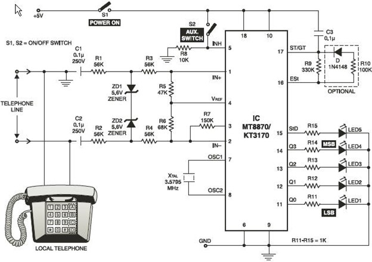

# 📞 Dual Tone Multi-Frequency (DTMF) Decoder using MT8870

This project demonstrates a DTMF-based home automation system that allows users to control appliances remotely using tones generated by a mobile phone keypad. The system uses the MT8870 DTMF Decoder IC to decode tone signals and trigger corresponding outputs — such as LEDs or relays — making it ideal for low-cost automation.

> 🎓 Second Year Mini Project  
> EC5311 – Electronic Design Laboratory  
> 🏫 Madras Institute of Technology, Anna University  
> 📆 August 2023 – January 2024

---

## 🔧 Overview

The core objective of this project is to decode DTMF tones from a mobile phone using the **MT8870 IC** and convert them into digital signals. These decoded signals can then be used to control devices like fans, lights, or indicators (LEDs), offering a simple, wired home automation interface.

---

## 📦 Project Features

- ✅ Decodes keypad tones from mobile phones
- 💡 LED indication for each keypress (real-time feedback)
- 🔌 Works with 3.5 mm audio cable
- 🛠️ Simple, low-cost circuit (no microcontroller needed)
- 🔇 Power-saving mode via TOE (Tone Output Enable)
- 🔄 Easily expandable for IoT or voice assistant integration

---

## ⚙️ Hardware Components

| Component                  | Quantity | Purpose                                 |
|---------------------------|----------|-----------------------------------------|
| MT8870 DTMF Decoder IC    | 1        | Core signal decoding                    |
| LEDs                      | 5        | Status indication                       |
| 3.5 mm Audio Jack Cable   | 1        | Connect mobile to the circuit           |
| Resistors (100k, 330k, 220Ω) | Various | Current limiting & biasing              |
| Capacitors (10nF, 20pF)   | Various  | Filtering & oscillator configuration    |
| Crystal Oscillator (3.57 MHz) | 1    | Clock for MT8870 operation              |
| Power Supply (5V/9V)      | 1        | Circuit power                           |
| Wires + Breadboard        | —        | Assembly and testing                    |

---

## 💻 Software Requirements

- **No microcontroller or programming needed**
- Optional:
  - DTMF tone generator apps (for testing)
  - Proteus / LTspice (for circuit simulation)
  - Arduino (if expanding for advanced automation)

---

## 📁 Project Structure
```
dtmf-decoder/
├── DTMF_Decoder_Report.pdf # Complete project report
├── README.md # Project summary (this file)
├── circuit_diagram.jpg # Circuit layout or hand-drawn schematic
├── demo_photo.jpg # (Optional) Real-life working setup
```

---

## 📘 Project Report

📄 [Click here to download the full report](./DTMF_Decoder_Report.pdf)

The report includes:
- Abstract and Objective
- Complete Circuit Description
- Pin Configuration of MT8870
- Working Methodology
- Pros and Cons
- Real-World Applications
- Future Work Suggestions

---

## 🖼️ Preview

  
*Figure: Schematic layout using MT8870 and indicator LEDs*

---

## 🚀 Applications

- 🏠 **Home Automation**: Remote control of fans/lights via keypad input  
- 🔒 **Security Systems**: Remote lock/unlock or alarm control  
- 🏭 **Industrial Automation**: Low-cost signal input control  
- 🌾 **Agriculture**: Remote operation of water pumps or sensors  
- 🚗 **Automotive**: Unlock doors or start ignition remotely  
- 🎓 **Educational**: Teaches signal decoding and hardware interfacing

---

## 🙋‍♀️ Project Team

- **Keerthana** – 2022504024  
- **Yuvaraj** – 2022504554  
- **Lokeshwaran** – 2022504057  
- **Sakthi Aadhavan** – 2022504056  

**Guide**: Dr. A. Divya  
Assistant Professor, Department of Electronics Engineering,  
MIT Campus, Anna University

---

## 🔗 References

- [MT8870 Datasheet](https://www.electronics-tutorials.ws/wp-content/uploads/2018/05/MT8870-datasheet.pdf)
- [DTMF Decoder Tutorial](https://www.myclassbook.org/2017/03/how-to-make-dtmf-decoder-electronics.html)
- [Electronics StackExchange – Audio Jack Pinout](https://electronics.stackexchange.com/questions/198261/pin-configuration-for-breadboard-3-5mm-stereo-audio-jack)

---

## 🛡️ License

This project is intended for educational purposes. You are free to use, adapt, and share with appropriate credit to the authors.


